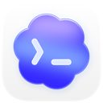

# Unofficial App Store Connect CLI

<p align="center">
  <a href="https://github.com/ASOManiac/aso-cli/releases/latest"></a>
  <a href="https://github.com/ASOManiac/aso-cli/stargazers"></a>
  
  
  
  <a href="https://github.com/ASOManiac/aso-cli/releases" title="GitHub release assets (all-time) + Homebrew installs (365d), see docs/badges/README.md"></a>
</p>

<p align="center">
  
</p>

A fast, lightweight, and scriptable CLI for the App Store Connect API.
Automate iOS, macOS, tvOS, and visionOS release workflows from your terminal, IDE, or CI/CD pipeline.

## Table of Contents

- [aso skills](#aso-skills)
- [Sponsors](#sponsors)
- [Quick Start](#quick-start)
- [Troubleshooting](#troubleshooting)
- [Support](#support)
- [Wall of Apps](#wall-of-apps)
- [Common Workflows](#common-workflows)
- [Commands and Reference](#commands-and-reference)
- [Documentation](#documentation)
- [Contributing](#contributing)
- [License](#license)

## aso skills

Agent Skills for automating `aso` workflows including builds, TestFlight, metadata sync, submissions, and signing:
https://github.com/rudrankriyam/app-store-connect-cli-skills

## Sponsors

<p align="center">
  <a href="https://rork.com/">
    
  </a>
  &nbsp;&nbsp;&nbsp;&nbsp;
  <a href="https://x.com/vibecodeapp_">
    
  </a>
</p>

[Rork](https://rork.com/) helps you build real mobile apps by chatting with AI, going from idea to phone in minutes and to the App Store in hours.

[Vibecode](https://x.com/vibecodeapp_) helps you build mobile apps and web apps with AI, turning ideas into working products in seconds.

## Quick Start

If you want to confirm the binary works before configuring authentication:

```bash
aso version
aso --help
```

### 1. Install

```bash
# Homebrew (recommended)
brew install aso

# Install script (macOS/Linux)
curl -fsSL https://asccli.sh/install | bash
```

For source builds and contributor setup, see [CONTRIBUTING.md](CONTRIBUTING.md).

### 2. Authenticate

```bash
aso auth login \
  --name "MyApp" \
  --key-id "ABC123" \
  --issuer-id "DEF456" \
  --private-key /path/to/AuthKey.p8 \
  --network
```

Generate API keys at:
https://appstoreconnect.apple.com/access/integrations/api

If you are running in CI, a headless shell, or a machine where keychain access is not available, use config-backed auth instead:

```bash
aso auth login \
  --bypass-keychain \
  --name "MyCIKey" \
  --key-id "ABC123" \
  --issuer-id "DEF456" \
  --private-key /path/to/AuthKey.p8
```

### 3. Validate auth

```bash
aso auth status --validate
aso auth doctor
```

### 4. First command

```bash
aso apps list --output table
aso apps list --output json --pretty
```

### Output defaults (TTY-aware)

`aso` chooses a default `--output` based on where stdout is connected:

- Interactive terminal (TTY): `table`
- Non-interactive output (pipes/files/CI): `json`

You can still set a global preference:

```bash
export ASC_DEFAULT_OUTPUT=markdown
```

And explicit flags always win:

```bash
aso apps list --output json
```

## Troubleshooting

### Homebrew

- Refresh Homebrew first: `brew update && brew upgrade aso`
- Check which binary you are running: `which aso`
- Confirm the installed version: `aso version`
- If Homebrew is behind the latest GitHub release, use the install script from `https://asccli.sh/install`

### Authentication

- Validate the active profile: `aso auth status --validate`
- Run the auth health check: `aso auth doctor`
- If keychain access is blocked, retry with `ASC_BYPASS_KEYCHAIN=1` or re-run `aso auth login --bypass-keychain`
- Use `aso auth login --local --bypass-keychain ...` when you want repo-local credentials in `./.asc/config.json`

### Output

- `aso` defaults to `table` in an interactive terminal and `json` in pipes, files, and CI
- Use an explicit format when scripting or sharing repro steps: `--output json`, `--output table`, or `--output markdown`
- Use `--pretty` with JSON when you want readable output in terminals or bug reports
- Set a personal default with `ASC_DEFAULT_OUTPUT`, but remember `--output` always wins

## Support

- Use [GitHub Discussions](https://github.com/ASOManiac/aso-cli/discussions) for install help, authentication setup, workflow advice, and "how do I...?" questions
- Use [GitHub Issues](https://github.com/ASOManiac/aso-cli/issues) for reproducible bugs and concrete feature requests
- See [SUPPORT.md](SUPPORT.md) for the support policy and bug-report checklist
- Before filing an auth or API bug, retry with `ASC_BYPASS_KEYCHAIN=1`; if it is safe to do so, include redacted output from `ASC_DEBUG=api aso ...` or `aso --api-debug ...`

## Wall of Apps

[See the Wall of Apps →](https://asccli.sh/#wall-of-apps)

Want to add yours?
`aso apps wall submit --app "1234567890" --confirm`

The command uses your authenticated `gh` session to fork the repo and open a pull request that updates `docs/wall-of-apps.json`.
It resolves the public App Store name, URL, and icon from the app ID automatically. For manual entries that are not on the public App Store yet, use `--link` with `--name`.
Use `aso apps wall submit --dry-run` to preview the fork, branch, and PR plan before creating anything.

## Common Workflows

### TestFlight feedback and crashes

```bash
aso testflight feedback list --app "123456789" --paginate
aso testflight crashes list --app "123456789" --sort -createdDate --limit 10
aso testflight crashes log --submission-id "SUBMISSION_ID"
```

### Builds and distribution

```bash
aso builds upload --app "123456789" --ipa "/path/to/MyApp.ipa"
aso builds list --app "123456789" --output table
aso testflight groups list --app "123456789" --output table
```

### Release (high-level: validate + attach + submit)

```bash
# Dry-run first to preview steps
aso release run --app "123456789" --version "1.2.3" --build "BUILD_ID" --metadata-dir "./metadata/version/1.2.3" --dry-run

# Run the full pipeline: ensure version, apply metadata, attach build, validate, submit
aso release run --app "123456789" --version "1.2.3" --build "BUILD_ID" --metadata-dir "./metadata/version/1.2.3" --confirm

# Monitor status after submission
aso status --app "123456789"
```

Lower-level alternatives (for scripting or partial workflows):

```bash
aso validate --app "123456789" --version "1.2.3"
aso submit create --app "123456789" --version "1.2.3" --build "BUILD_ID" --confirm
```

### Metadata and localization

```bash
aso localizations list --app "123456789"
aso apps info view --app "123456789" --output json --pretty
```

### Screenshots and media

```bash
aso screenshots list --app "123456789"
aso video-previews list --app "123456789"
```

### Signing and bundle IDs

```bash
aso certificates list
aso profiles list
aso bundle-ids list
```

### Workflow automation

```bash
aso workflow run release
```

### Verified local Xcode -> TestFlight workflow

See [docs/WORKFLOWS.md](docs/WORKFLOWS.md) for a copyable `.asc/workflow.json`
and `ExportOptions.plist` that use `aso builds latest`, `aso xcode archive`,
`aso xcode export`, and `aso publish testflight --group ... --wait`.

```bash
aso workflow validate
aso workflow run --dry-run testflight_beta VERSION:1.2.3
aso workflow run testflight_beta VERSION:1.2.3
```

### Xcode Cloud workflows and build runs

```bash
# Trigger from a pull request
aso xcode-cloud run --workflow-id "WORKFLOW_ID" --pull-request-id "PR_ID"

# Rerun from an existing build run with a clean build
aso xcode-cloud run --source-run-id "BUILD_RUN_ID" --clean

# Fetch a single build run by ID
aso xcode-cloud build-runs get --id "BUILD_RUN_ID"
```

## Commands and Reference

Use built-in help as the source of truth:

```bash
aso --help
aso <command> --help
aso <command> <subcommand> --help
```

For full command families, flags, and discovery patterns, see:
- [docs/COMMANDS.md](docs/COMMANDS.md)

## Documentation

- [docs/CI_CD.md](docs/CI_CD.md) - CI/CD integration guides (GitHub Actions, GitLab, Bitrise, CircleCI)
- [docs/COMMANDS.md](docs/COMMANDS.md) - Command families and reference navigation
- [docs/WORKFLOWS.md](docs/WORKFLOWS.md) - Reusable workflow patterns, including local Xcode to TestFlight
- [docs/API_NOTES.md](docs/API_NOTES.md) - API quirks and behaviors
- [docs/CONTRIBUTING.md](docs/CONTRIBUTING.md) - CLI development and testing notes
- [docs/TESTING.md](docs/TESTING.md) - Testing patterns and conventions
- [docs/openapi/README.md](docs/openapi/README.md) - Offline OpenAPI snapshot + update flow
- [CONTRIBUTING.md](CONTRIBUTING.md) - Contribution guide

## Acknowledgements

Local screenshot framing uses Koubou (pinned to `0.18.1`) for deterministic device-frame rendering.
GitHub: https://github.com/bitomule/koubou

Simulator UI automation for screenshot capture and interactions uses AXe CLI.
GitHub: https://github.com/cameroncooke/AXe

## Contributing

Contributions are welcome. See [CONTRIBUTING.md](CONTRIBUTING.md) for details.

## License

MIT License - see [LICENSE](LICENSE) for details.

## Author

[Rudrank Riyam](https://github.com/rudrankriyam)

## Star History

[](https://star-history.com/#ASOManiac/aso-cli&Date)

---

<p align="center">
  
  
</p>

<p align="center">
  Built with Codex &amp; Cursor using GPT-5.3-Codex and GPT-5.4
</p>

<p align="center">
  <sub>This project is an independent, unofficial tool and is not affiliated with, endorsed by, or sponsored by Apple Inc. App Store Connect, TestFlight, Xcode Cloud, and Apple are trademarks of Apple Inc., registered in the U.S. and other countries.</sub>
</p>
